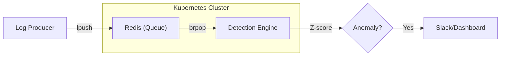

# Log-Guard

**Real-time Log Anomaly Detection System using Z-score Analysis**

서버 로그를 실시간으로 수집하고, 통계적 방법(Z-score)으로 이상 트래픽을 자동 감지하는 시스템입니다.

이 프로젝트는 **Vibe Coding** 철학을 바탕으로 개발되었으며, 로컬 환경을 넘어 **쿠버네티스(Kubernetes)** 클러스터 상에서의 운영 및 확장성까지 고려하여 설계되었습니다.


## 빠른 시작

### 모드 1: 로컬 통합 실행 (Easy)
```bash
# Redis(Brew) + Backend + Browser 자동 실행
python3 run.py
```

### 모드 2: 쿠버네티스 배포 (Advanced) ☸️
```bash
# Minikube + K8s Manifest + Image Build + Service 자동 실행
python3 run-k8s.py
```

## 🏗️ 아키텍처 및 클라우드 네이티브 설계



### Kubernetes 인프라 구성
- **Deployment**: 백엔드 서버의 고가용성(High Availability) 보장 (Multi-replica 구성)
- **Service (NodePort)**: 클러스터 외부와 백엔드 서버 간의 연결 통신
- **Service Discovery**: `redis-service` 이름을 통한 내부 DNS 기반 마이크로서비스 통신
- **Containerization**: `python:3.9-slim` 기반의 최적화된 도커 이미지

## 기술 스택

- **Backend**: Python 3.9+ / FastAPI / Pandas / NumPy
- **Frontend**: Vanilla JS / Chart.js (CDN) / CSS3 (Glassmorphism)
- **Infrastructure**: **Kubernetes (Minikube)**, **Docker**, Redis
- **Monitoring**: WebSocket Real-time Streaming, Slack Anomaly Alerts

---

## 상세 설정 가이드

### 1. 환경 설정
```bash
python -m venv venv
source venv/bin/activate
pip install -r requirements.txt
cp .env.example .env
```

### 2. 수동 쿠버네티스 배포
스크립트 없이 수동으로 제어하고 싶을 때:
```bash
# YAML 파일 적용
kubectl apply -f k8s/

# 상태 확인
kubectl get pods
kubectl get services

# 대시보드 접속 주소 확인
minikube service backend-service
```

---

## 이상 탐지 원리 (Z-score)

데이터의 분포를 분석하여 평소와 다른 '이상 거동'을 수학적으로 탐지합니다.

- `Z = (현재값 - 평균) / 표준편차`
- **|Z| >= 3.0** 이면 이상치로 판정 (정규분포 기준 상위 0.3% 수준의 희귀 케이스)

## License
MIT
