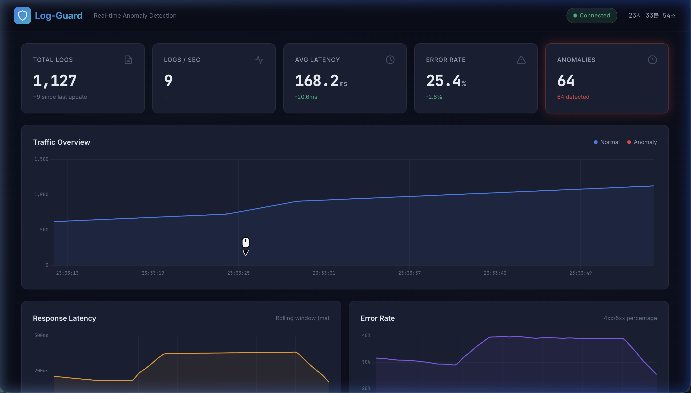
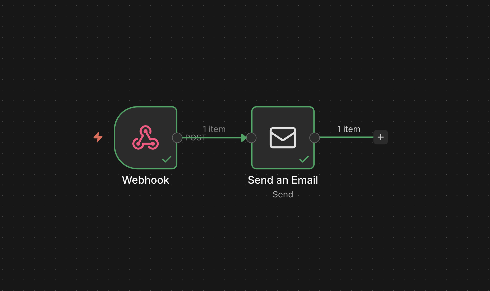
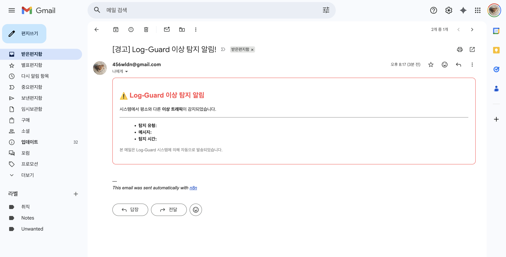
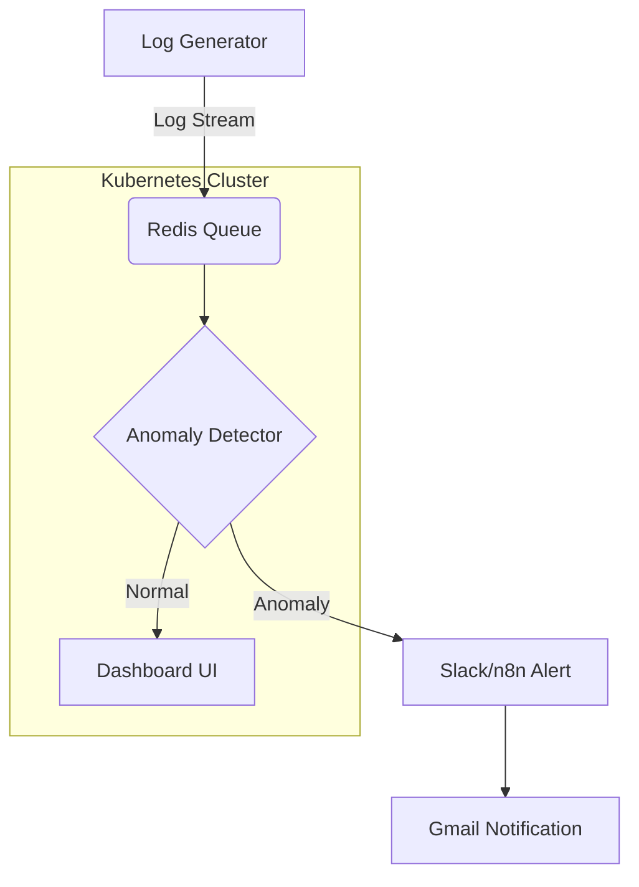

# Log-Guard: AI 기반 실시간 로그 이상 탐지 시스템

> **"Vibe Coding" 철학으로 완성된 지능형 보안 인프라.**  
> 단순한 분석을 넘어, 쿠버네티스 기반의 클러스터 환경과 n8n 자동화 워크플로우를 결합한 차세대 로그 감시 시스템입니다.


<br>

## 🌐 Live Demo
> **[지능형 로그 대시보드 맛보기 (클릭)](https://Jeongjiw00.github.io/logguard)**  
> *서버 연결 없이도 작동하는 '데모 모드'가 탑재되어 있어, 브라우저에서 바로 실시간 분석 화면을 체험해 보실 수 있습니다.*

## 핵심 기능 및 배포 가이드

### 1. 로컬 통합 실행 (local)
가장 빠르게 시스템을 체험해 볼 수 있는 모드입니다. 단 한 줄의 명령어로 데이터 생성부터 대시보드 확인까지 가능합니다.
```bash
python3 run.py
```

### 2. 쿠버네티스 클라우드 네이티브 (k8s)
`Minikube` 기반의 로컬 클러스터에 전체 인프라를 배포하여 대규모 환경을 시뮬레이션합니다.
- **Containerization**: Docker를 활용한 고효율 이미지 빌드.
- **Orchestration**: Kubernetes 기반의 자동 복구 및 확장성 확보.
- **One-Click Deployment**: `run-k8s.py`를 통한 복잡한 인프라 배포 자동화.
```bash
python3 run-k8s.py
```

### 3. 지능형 자동화 모니터링 (n8n)
이상 징후 발생 시 자동으로 대응 워크플로우를 실행하여 비즈니스 가치를 더합니다.
- **n8n Workflow**: 이상 탐지 즉시 Webhook을 통해 자동화 시나리오 트리거.
- **Real-time Alerting**: Gmail SMTP를 연동한 HTML 기반 보안 경고 리포트 자동 발송.

```bash
# n8n 대시보드 및 워크플로우 편집기 열기
minikube service n8n-service
```


*n8n을 통한 지능형 알림 워크플로우 설계*


*이상 탐지 시 자동으로 발송되는 HTML 이메일 결과*

---

## 시스템 아키텍처



- **Deployment**: 백엔드 서버의 고가용성(High Availability) 보장 (Multi-replica 구성)
- **ServiceDiscovery**: `redis-service`, `n8n-service` 이름을 통한 내부 DNS 기반 마이크로서비스 통신.
- **Anomaly Detection Engine**: Z-Score 기반의 통계적 변이 추적 알고리즘 탑재.

---

## Vibe Coding & Philosophy
이 프로젝트는 AI 비서와 개발자가 **'Vibe'**를 맞춰가며 설계되었습니다. 
단순 코드 작성을 넘어 **기획 -> 수학적 알고리즘 설계 -> 인프라 구축 -> 자동화 파이프라인**까지의 전 과정을 AI와 상호작용하며 민첩하게 구현해내는 현대적인 개발 방식을 지향합니다.

## 기술 스택
- **Backend**: Python 3.9+, FastAPI
- **Data**: Pandas, NumPy (Statistical Analysis)
- **Infra**: Docker, Kubernetes (Minikube)
- **Automation**: n8n, Redis
- **Frontend**: HTML5, Vanilla CSS, JS

---
*Developed with ❤️ and AI at Jiwoo's Workspace.*
